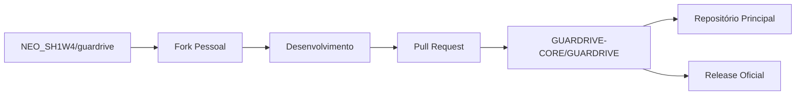

# 🛡️ GUARDRIVE MCP Servers - Complete Development Guide

**Guia completo para desenvolvimento, configuração e uso dos MCP Servers GUARDRIVE**

## 📋 **Índice**

1. [Quick Start](#quick-start)
2. [Estratégia Organization-First](#estratégia-organization-first)
3. [Configuração do Ambiente](#configuração-do-ambiente)
4. [Workflow de Desenvolvimento](#workflow-de-desenvolvimento)
5. [Configuração no Warp Terminal](#configuração-no-warp-terminal)
6. [MCP Servers Disponíveis](#mcp-servers-disponíveis)
7. [Comandos de Uso](#comandos-de-uso)
8. [Troubleshooting](#troubleshooting)
9. [Próximos Passos](#próximos-passos)

---

## 🚀 **Quick Start**

### **Pré-requisitos**
- Windows 10/11
- Node.js ≥ 18.0.0
- Git ≥ 2.40
- Warp Terminal
- GitHub CLI (gh)
- PowerShell 5.1+

### **Instalação Rápida**
```bash
# 1. Clonar repositório oficial
git clone https://github.com/GUARDRIVE-CORE/GUARDRIVE.git
cd GUARDRIVE

# 2. Instalar dependências
npm run setup

# 3. Verificar instalação
npm run test:all

# 4. Verificar MCP Servers
npm run devops-orchestrator:test
npm run system-monitor:test
```

---

## 🎯 **Estratégia Organization-First**

### **Repositórios e Fluxo**



### **Estrutura de Desenvolvimento**

| Repositório | Propósito | URL |
|-------------|-----------|-----|
| **GUARDRIVE-CORE/GUARDRIVE** | Oficial, Releases, Colaboração | https://github.com/GUARDRIVE-CORE/GUARDRIVE |
| **NEO_SH1W4/guardrive** | Fork pessoal, Desenvolvimento | https://github.com/NEO_SH1W4/guardrive |

---

## ⚙️ **Configuração do Ambiente**

### **1. Configuração Inicial**

#### **Windows PowerShell Profile Setup**
```powershell
# Verificar se perfil existe
Test-Path $PROFILE

# Se não existir, criar
if (!(Test-Path $PROFILE)) {
    New-Item -Type File -Path $PROFILE -Force
}

# Adicionar aliases úteis
Add-Content $PROFILE @"
# GUARDRIVE MCP Aliases
function gd-start { cd D:\GUARDRIVE-CORE\GUARDRIVE-workdir }
function gd-status { git status; git remote -v }
function gd-sync { git pull origin main; gh release list }
function gd-devops { cd .\devops-orchestrator; npm start }
function gd-monitor { cd .\system-monitor; npm start }
"@

# Recarregar perfil
. $PROFILE
```

#### **GitHub CLI Configuration**
```bash
# Login no GitHub CLI
gh auth login

# Verificar autenticação
gh auth status

# Configurar fork automático
gh config set git_protocol https
```

### **2. Diretório de Trabalho**

#### **Estrutura Recomendada**
```
D:\GUARDRIVE-CORE\
├── GUARDRIVE-workdir\           # Repositório oficial (local)
│   ├── devops-orchestrator\     # MCP Server principal
│   ├── system-monitor\          # MCP Server de monitoramento
│   ├── README.md                # Documentação principal
│   ├── SESSION-STRATEGY.md      # Estratégia de desenvolvimento
│   └── MCP-DEVELOPMENT-GUIDE.md # Este guia
└── guardrive-fork\              # Fork pessoal (se clonado)
    └── (mesmo conteúdo)
```

---

## 🔄 **Workflow de Desenvolvimento**

### **Para Primeira Sessão**

#### **1. Setup do Repositório Principal**
```bash
# Navegar para área de trabalho
cd D:\GUARDRIVE-CORE\GUARDRIVE-workdir

# Verificar estado
git status
git remote -v
git log --oneline -5

# Sincronizar
git pull origin main
gh release list
```

#### **2. Criar Fork Pessoal (Uma vez)**
```bash
# Fork via GitHub CLI
gh repo fork GUARDRIVE-CORE/GUARDRIVE

# Clonar fork
git clone https://github.com/NEO_SH1W4/guardrive.git D:\GUARDRIVE-CORE\guardrive-fork
cd D:\GUARDRIVE-CORE\guardrive-fork

# Configurar upstream
git remote add upstream https://github.com/GUARDRIVE-CORE/GUARDRIVE.git
git fetch upstream
```

### **Para Desenvolvimento de Features**

#### **1. No Fork Pessoal**
```bash
cd D:\GUARDRIVE-CORE\guardrive-fork

# Sincronizar com upstream
git fetch upstream
git checkout main
git merge upstream/main
git push origin main

# Criar branch para feature
git checkout -b feature/nova-funcionalidade

# Desenvolver...
# Fazer commits...

# Push para fork
git push origin feature/nova-funcionalidade

# Criar PR
gh pr create --title "Feature: Nova funcionalidade" --body "Descrição detalhada"
```

#### **2. Para Hotfixes Urgentes**
```bash
# Trabalhar diretamente no repositório principal
cd D:\GUARDRIVE-CORE\GUARDRIVE-workdir

# Criar branch
git checkout -b hotfix/correcao-critica

# Corrigir...
git add -A
git commit -m "fix: correção crítica"
git push origin hotfix/correcao-critica

# Merge direto ou PR
```

### **Finalização de Sessão**

#### **Checklist de Fim de Sessão** ✅
```bash
# 1. Verificar pendências
git status

# 2. Commit trabalho em progresso
git add -A
git commit -m "WIP: sessão 2025-06-26"
git push

# 3. Atualizar documentação
# - Atualizar TASKS.md
# - Documentar decisões importantes

# 4. Sincronizar principal (se necessário)
cd D:\GUARDRIVE-CORE\GUARDRIVE-workdir
git push origin main
```

---

## 🔧 **Configuração no Warp Terminal**

### **Arquivo de Configuração MCP**

#### **Localização**: `%APPDATA%\Warp\mcp_servers.json`

```json
{
  "mcpServers": {
    "guardrive-devops": {
      "command": "node",
      "args": ["D:\\GUARDRIVE-CORE\\GUARDRIVE-workdir\\devops-orchestrator\\index.js"],
      "env": {
        "NODE_ENV": "production"
      }
    },
    "guardrive-monitor": {
      "command": "node", 
      "args": ["D:\\GUARDRIVE-CORE\\GUARDRIVE-workdir\\system-monitor\\index.js"],
      "env": {
        "NODE_ENV": "production"
      }
    }
  }
}
```

### **Configuração Alternativa (Development)**

```json
{
  "mcpServers": {
    "guardrive-devops-dev": {
      "command": "npm",
      "args": ["start"],
      "cwd": "D:\\GUARDRIVE-CORE\\guardrive-fork\\devops-orchestrator"
    },
    "guardrive-monitor-dev": {
      "command": "npm", 
      "args": ["start"],
      "cwd": "D:\\GUARDRIVE-CORE\\guardrive-fork\\system-monitor"
    }
  }
}
```

---

## 🚀 **MCP Servers Disponíveis**

### **1. DevOps Orchestrator** ⭐ *Flagship*

#### **Propósito**
O MCP Server mais inteligente - Orquestra todo o workflow de desenvolvimento seguindo as Session Rules, Branching Rules, Code Style Rules e PR Rules.

#### **Ferramentas Disponíveis (7)**

| Categoria | Ferramenta | Comando | Descrição |
|-----------|------------|---------|-----------|
| 🌟 **Session** | `start_dev_session` | "Iniciar sessão de desenvolvimento" | Checklist completo + verificação ambiente |
| 🌟 **Session** | `end_dev_session` | "Finalizar sessão de desenvolvimento" | Auto-commit + limpeza + docs |
| 🌿 **Git Ops** | `create_feature_branch` | "Criar branch para [feature]" | Branches seguindo convenções |
| 🌿 **Git Ops** | `smart_commit` | "Fazer commit [mensagem]" | Conventional Commits automático |
| 🌿 **Git Ops** | `prepare_pr` | "Preparar PR para [feature]" | Templates de PR completos |
| 🛡️ **Quality** | `quality_gate` | "Verificar qualidade do código" | Lint + Tests + Security audit |
| 🛡️ **Quality** | `fix_code_style` | "Corrigir estilo do código" | Auto-fix prettier/eslint |

#### **Exemplos de Uso**
```
"Iniciar sessão de desenvolvimento"
"Criar branch para implementar autenticação"
"Fazer commit seguindo conventional commits"
"Verificar qualidade do código"
"Preparar PR para revisão"
"Finalizar sessão de desenvolvimento"
```

### **2. System Monitor** 

#### **Propósito**
Monitoramento inteligente - Métricas e health checks do sistema seguindo Log Policy e Health Monitoring Rules.

#### **Ferramentas Disponíveis (3)**

| Ferramenta | Comando | Descrição |
|------------|---------|-----------|
| `get_system_metrics` | "Verificar métricas do sistema" | Coleta métricas instantâneas (CPU, RAM, Disco) |
| `save_metrics_to_file` | "Salvar dados de monitoramento" | Persistência em CSV seguindo Log Policy |
| `get_system_health_report` | "Gerar relatório de saúde" | Análise completa com alertas inteligentes |

#### **Exemplos de Uso**
```
"Verificar métricas do sistema"
"Salvar dados de monitoramento"
"Gerar relatório de saúde completo"
```

---

## 💬 **Comandos de Uso**

### **DevOps Orchestrator Commands**

#### **Session Management**
```
✅ "Iniciar sessão de desenvolvimento"
   → Executa checklist completo de início
   → Verifica ferramentas (Git, Node, Python)
   → Sincroniza repositório
   → Cria log de sessão

✅ "Finalizar sessão de desenvolvimento"  
   → Commit trabalho pendente
   → Atualiza documentação
   → Limpa ambiente
   → Cria relatório de sessão
```

#### **Git Operations**
```
✅ "Criar branch para implementar [feature]"
   → Cria branch seguindo convenção feature/nome
   → Sincroniza com main
   → Configura tracking automático

✅ "Fazer commit [mensagem]"
   → Aplica Conventional Commits
   → Valida mensagem
   → Adiciona quebras automáticas
   → Push inteligente

✅ "Preparar PR para [feature]"
   → Gera template de PR
   → Adiciona checklist
   → Configura reviewers
   → Cria link do PR
```

#### **Quality Assurance**
```
✅ "Verificar qualidade do código"
   → Executa ESLint/Prettier
   → Roda testes unitários
   → Verifica cobertura
   → Audit de segurança

✅ "Corrigir estilo do código"
   → Auto-fix ESLint
   → Formata com Prettier
   → Organiza imports
   → Aplica code style rules
```

### **System Monitor Commands**

#### **Metrics Collection**
```
✅ "Verificar métricas do sistema"
   → CPU usage atual
   → RAM disponível
   → Espaço em disco
   → Performance instantânea

✅ "Salvar dados de monitoramento"
   → Cria arquivo CSV diário
   → Aplica Log Policy (90 dias)
   → Compressão automática
   → Timestamp ISO 8601

✅ "Gerar relatório de saúde completo"
   → Análise de tendências
   → Alertas inteligentes
   → Recomendações
   → Histórico comparativo
```

---

## 🔍 **Troubleshooting**

### **Problemas Comuns**

#### **1. MCP Server não conecta**
```bash
# Verificar se Node.js está funcionando
node --version

# Verificar se arquivo existe
ls D:\GUARDRIVE-CORE\GUARDRIVE-workdir\devops-orchestrator\index.js

# Testar execução manual
cd D:\GUARDRIVE-CORE\GUARDRIVE-workdir\devops-orchestrator
npm start

# Verificar logs do Warp
# Warp → Settings → MCP → View Logs
```

#### **2. Git abre "Selecionar aplicação"**
```powershell
# Executar script de correção
C:\Users\laiss\fix-git-admin.ps1

# Ou corrigir manualmente
git config --global core.editor "code --wait"
```

#### **3. Comandos não são reconhecidos**
```bash
# Verificar PATH
echo $env:PATH

# Adicionar caminhos necessários
$env:PATH += ";C:\Program Files\Git\bin"
$env:PATH += ";C:\Program Files\nodejs"

# Recarregar PowerShell profile
. $PROFILE
```

### **Scripts de Diagnóstico**

#### **health-check.ps1**
```powershell
# Salvar como health-check.ps1
Write-Host "🛡️ GUARDRIVE Health Check" -ForegroundColor Blue

# Verificar ferramentas
Write-Host "`n1. Verificando ferramentas..." -ForegroundColor Yellow
try { git --version; Write-Host "✅ Git OK" } catch { Write-Host "❌ Git ERRO" }
try { node --version; Write-Host "✅ Node.js OK" } catch { Write-Host "❌ Node.js ERRO" }
try { gh --version; Write-Host "✅ GitHub CLI OK" } catch { Write-Host "❌ GitHub CLI ERRO" }

# Verificar repositório
Write-Host "`n2. Verificando repositório..." -ForegroundColor Yellow
if (Test-Path "D:\GUARDRIVE-CORE\GUARDRIVE-workdir\.git") {
    Write-Host "✅ Repositório OK"
    cd D:\GUARDRIVE-CORE\GUARDRIVE-workdir
    git status --porcelain
} else {
    Write-Host "❌ Repositório não encontrado"
}

# Verificar MCP Servers
Write-Host "`n3. Verificando MCP Servers..." -ForegroundColor Yellow
if (Test-Path "D:\GUARDRIVE-CORE\GUARDRIVE-workdir\devops-orchestrator\index.js") {
    Write-Host "✅ DevOps Orchestrator OK"
} else {
    Write-Host "❌ DevOps Orchestrator não encontrado"
}

if (Test-Path "D:\GUARDRIVE-CORE\GUARDRIVE-workdir\system-monitor\index.js") {
    Write-Host "✅ System Monitor OK"
} else {
    Write-Host "❌ System Monitor não encontrado"
}

Write-Host "`n🎯 Health Check Completo!" -ForegroundColor Green
```

---

## 📈 **Próximos Passos**

### **Roadmap de Desenvolvimento**

#### **v1.3 (Próximas 2 semanas)**
- [ ] **Configurar fork pessoal** NEO_SH1W4
- [ ] **Testar workflow completo** de PR
- [ ] **Primeira feature via PR** (exemplo)
- [ ] **Documentar processo** real

#### **v1.4 (1 mês)**
- [ ] **Backup Orchestrator MCP** - Automação de backup
- [ ] **Security Auditor MCP** - Verificações de segurança
- [ ] **Performance Optimizer MCP** - Otimizações automáticas
- [ ] **CI/CD Integration** - Trigger de pipelines

#### **v2.0 (3 meses)**
- [ ] **Issue Tracking Integration** - Jira/GitHub Issues
- [ ] **Notifications** - Slack/Teams/Email
- [ ] **Analytics Dashboard** - Métricas de produtividade
- [ ] **Community Edition** - Versão open source

### **Melhorias de Processo**

#### **Automação**
- [ ] GitHub Actions para CI/CD
- [ ] Auto-deploy em staging
- [ ] Testes automatizados
- [ ] Code coverage reports

#### **Documentação**
- [ ] Video tutorials
- [ ] API documentation
- [ ] Integration examples
- [ ] Best practices guide

#### **Comunidade**
- [ ] Contributing guidelines
- [ ] Issue templates
- [ ] Discord/Slack channel
- [ ] Regular releases

---

## 📚 **Recursos Adicionais**

### **Links Importantes**
- **Repositório Oficial**: https://github.com/GUARDRIVE-CORE/GUARDRIVE
- **Releases**: https://github.com/GUARDRIVE-CORE/GUARDRIVE/releases
- **Issues**: https://github.com/GUARDRIVE-CORE/GUARDRIVE/issues
- **Warp Terminal**: https://app.warp.dev/
- **MCP Protocol**: https://modelcontextprotocol.io/

### **Documentação Relacionada**
- `README.md` - Documentação principal
- `SESSION-STRATEGY.md` - Estratégia de desenvolvimento
- `CHANGELOG.md` - Histórico de versões
- `CONTRIBUTING.md` - Guia de contribuição

### **Scripts Úteis**
- `health-check.ps1` - Diagnóstico completo
- `fix-git-admin.ps1` - Correção de Git
- `setup.ps1` - Configuração inicial

---

**📅 Última Atualização**: 2025-06-26  
**🛡️ Versão**: 1.0.2  
**📖 Tipo**: Complete Development Guide  
**🚀 Status**: Pronto para Uso

---

> *"Com este guia, o desenvolvimento GUARDRIVE MCP Servers estará acessível de qualquer lugar!"* 🌍

